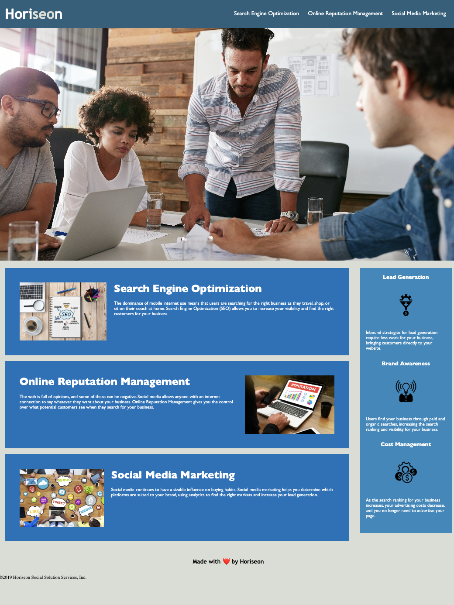

PROJECT TITILE:
HORISEON APPLICATION UPDATE

INSTALLATION AND UPDATES MADE:
1.	The HTML and CSS Files were Updated to meet accessibility standards by adding semantic HTML elements and linking them with CSS.
2.	The title was updated to include the client names.
3.	CSS and HTML files were updated to include descriptors in the code.
4.	A repository for the updated code was created on GitHub for others to review.

MOTIVATION:
The changes in the code were made to meet the accessibility standards.

SCREEN SHOT OF HORISEON WEBSITE

LICENSES:
The code has an MIT License.

CREDITS:
UMN Bootcamp Tutoring Staff.

